# Part 1: Foundation - From API Calls to Conversations 🎯

*Building AI from First Principles Series*

**Status: Complete ✅**

## 🎯 What You'll Learn

By the end of this part, you'll understand:

- **The PocketFlow Pattern** - How `prep → exec → post` makes AI code cleaner and more testable
- **Shared Storage Architecture** - How to maintain state across AI interactions  
- **Reusable Node Components** - Building blocks you can use in any AI project
- **From API to Conversation** - The difference between single completions and real chatbots

## 🚧 The Challenge We're Solving

Most AI tutorials teach you to copy-paste API calls that quickly become unmaintainable:

```typescript
// The typical approach - everything mixed together
async function chatbot(message: string) {
    const conversation = [];
    conversation.push({role: 'user', content: message});
    const response = await openai.complete(conversation);
    conversation.push({role: 'assistant', content: response});
    return conversation;
}
```

This approach breaks down when you need testing, error handling, retries, or complex workflows. We'll transform this chaos into clean, scalable patterns that grow with your ambitions.

## 🏗️ What We're Building

Two progressive examples that transform you from API confusion to framework mastery:

**Architecture:**

```mermaid
graph LR
    A["User Message"] --> B["ChatNode<br/>(prep→exec→post)"] --> C["Assistant Response"]
    C --> D["SharedStorage<br/>(Conversation Memory)"]
    D --> A
    
    classDef userMsg fill:#e3f2fd,stroke:#1976d2,stroke-width:2px
    classDef node fill:#e8f5e8,stroke:#388e3c,stroke-width:2px
    classDef storage fill:#fff3e0,stroke:#f57c00,stroke-width:2px
    classDef aiMsg fill:#f3e5f5,stroke:#7b1fa2,stroke-width:2px
    
    class A userMsg
    class B node
    class C aiMsg
    class D storage
```


## 📁 File Structure

```
01-foundations/
├── chat-completion.ts                    # Learn PocketFlow fundamentals
├── terminal-chat.ts                      # Build interactive conversations  
├── backpackflow-chat-completion.ts       # Framework comparison example
└── README.md                             # This complete guide
```

## 🚀 Quick Start

```bash
# Prerequisites: Set your OpenAI API key
echo "OPENAI_API_KEY=your-key-here" > .env

# Learn the fundamentals
npx tsx chat-completion.ts

# Try interactive chat
npx tsx terminal-chat.ts

# Compare with BackpackFlow framework
npx tsx backpackflow-chat-completion.ts
```

## 📚 Step-by-Step Guide

### Step 1: Understanding the PocketFlow Pattern 🧱

Traditional AI code mixes everything together. PocketFlow separates concerns with a clear three-phase pattern:

```typescript
// ❌ Traditional approach - everything mixed together
async function chatbot(message: string) {
    const conversation = [];
    conversation.push({role: 'user', content: message});
    const response = await openai.complete(conversation);
    conversation.push({role: 'assistant', content: response});
    return conversation;
}

// ✅ PocketFlow approach - separated concerns
class ChatNode extends Node<SharedStorage> {
    async prep(shared) { /* Prepare data */ }
    async exec(prepared) { /* Do the work */ }
    async post(shared, prepared, result) { /* Handle results */ }
}
```

**What's happening:**
1. **prep()** - Extract and transform data from SharedStorage
2. **exec()** - Process the data (isolated from storage)
3. **post()** - Load results back into SharedStorage

**Key Insight:** This is like ETL (Extract, Transform, Load) for AI workflows - clean, testable, and scalable.

### Step 2: Shared Storage - The Memory Center 🧠

Everything in PocketFlow revolves around the `SharedStorage` object that travels through your entire flow:

```typescript
type SharedStorage = {
    messages: Message[];  // Conversation history
    // Later we might add: context, metadata, user_data, etc.
}
```

This is the "memory" of your AI system - the center of everything in PocketFlow.


### Step 3: Building Your First Node 🔧

Let's build a ChatNode step by step:


```typescript
class ChatNode extends Node<SharedStorage> {
    // 1. PREP: Get data ready
    async prep(shared: SharedStorage): Promise<Message[]> {
        shared.messages.push({ role: 'user', content: this.userMessage });
        return shared.messages; // This goes to exec()
    }
    
    // 2. EXEC: Do the main work
    async exec(messages: Message[]): Promise<string> {
        const response = await this.llmProvider.complete(messages);
        return response.content; // This goes to post()
    }
    
    // 3. POST: Handle results
    async post(shared: SharedStorage, prepRes: unknown, execRes: unknown): Promise<string | undefined> {
        shared.messages.push({ role: 'assistant', content: execRes as string });
        return undefined; // End the flow
    }
}
```

**Why this separation matters:**
- **Prep**: Data validation, formatting, context building *(Extract & Transform)*
- **Exec**: The actual AI call (or any heavy computation) *(Process)*
- **Post**: Result processing, storage, error handling *(Load)*

**💡 Think of it like ETL (Extract, Transform, Load):**
- **prep()** = Extract data from SharedStorage + Transform it *(reads/writes SharedStorage)*
- **exec()** = Process the transformed data *(isolated - no SharedStorage access)*
- **post()** = Load results back into SharedStorage *(reads/writes SharedStorage)*

**🚀 Try it yourself:**
```bash
# Run the basic chat completion example
npx tsx chat-completion.ts
```

**Expected output:**
```
🎓 Chat Completion - PocketFlow Basics

Sending message...

Conversation:
1. user: Explain what PocketFlow's prep-exec-post pattern does in one sentence.
2. assistant: PocketFlow's prep-exec-post pattern separates AI workflows into three clean phases: prep organizes your data, exec does the actual work (like calling an LLM), and post handles the results - making your code more testable, debuggable, and reusable.

✅ Tutorial complete!

💡 This example shows PocketFlow fundamentals:
   • prep() - prepare data
   • exec() - do the work  
   • post() - handle results

🚀 Ready for interactive chat? Try terminal-chat.ts next!
```

**What you'll notice:**
- The response shows how **prep** added your message to the conversation
- The **exec** phase called the LLM with the conversation history  
- The **post** phase stored the AI's response back in SharedStorage

### Step 4: From Node to Interactive Chat 💬

Now let's see how the same ChatNode powers an interactive conversation:

```typescript
class TerminalChat {
    private shared: SharedStorage = { messages: [] };  // Persistent memory
    
    async processUserInput(input: string) {
        // Use the same ChatNode pattern for each interaction
        const response = await sendMessage(this.shared, input);
        // SharedStorage accumulates conversation history
    }
}
```

**Complete Example:**
```typescript
// chat-completion.ts - Learn the pattern
const shared: SharedStorage = { messages: [] };
const response = await sendMessage(shared, "Hello!");

// terminal-chat.ts - Apply the pattern
const chat = new TerminalChat();
await chat.start(); // Interactive conversation using same ChatNode
```

**🚀 Try the interactive version:**
```bash
# Run the interactive terminal chat
npx tsx terminal-chat.ts
```

**Expected interaction:**
```
🚀 Welcome to PocketFlow Terminal Chat!
💬 Type your messages and press Enter to chat with AI
🔚 Type "exit", "quit", or "bye" to end the conversation
📜 Type "history" to see the full conversation
🧹 Type "clear" to clear the conversation history
--------------------------------------------------

💬 You: Hello! How does PocketFlow work?
🤖 AI is thinking...
👤 You: Hello! How does PocketFlow work?
🤖 AI: PocketFlow works by organizing AI workflows into three clean phases: prep (organize data), exec (do the work), and post (handle results). This pattern makes your AI code more testable, debuggable, and reusable than traditional approaches.

💬 You: What's the benefit of SharedStorage?
🤖 AI is thinking...
👤 You: What's the benefit of SharedStorage?
🤖 AI: SharedStorage acts as the persistent memory of your AI system - it maintains conversation history, context, and state across multiple interactions, unlike stateless API calls that forget everything between requests.

💬 You: history
📜 Conversation History:
------------------------------
1. 👤 You: Hello! How does PocketFlow work?
2. 🤖 AI: PocketFlow works by organizing AI workflows...
3. 👤 You: What's the benefit of SharedStorage?  
4. 🤖 AI: SharedStorage acts as the persistent memory...
------------------------------

💬 You: exit
👋 Thanks for chatting! Goodbye!
```

**Key observation:** Notice how the AI remembers previous messages - this is **SharedStorage** in action!

## 🔍 From Raw Implementation to BackpackFlow Framework

Now that you've built working examples, let's understand how we transformed your learning into reusable BackpackFlow components. This is **framework thinking** in action!

### 🚀 Framework Implementation Example

lets's rebuild the same chat functionality using BackpackFlow's components:

** create `backpackflow-chat-completion.ts`:**


```typescript
// import env variables
import { config } from 'dotenv';
import path from 'path';
config({ path: path.join(__dirname, '.env') });

// import the relevant backpackflow modules (feel free to check the code out, this will loop similar to what we implemented before, with obvious changes to make things reusable)
import { OpenAIProvider } from 'backpackflow/providers/openai-provider';
import { ChatNode, ChatNodeStorage } from 'backpackflow/nodes/llm/chat-node';
import { Flow } from 'backpackflow/pocketflow';
```

```typescript
// BackpackFlow approach - using framework components
async function main() {
    console.log('🎓 BackpackFlow Framework Example\n');

    // 1. Use BackpackFlow's provider abstraction
    const llmProvider = new OpenAIProvider({
        apiKey: process.env.OPENAI_API_KEY ?? ''
    });

    // 2. Create a ChatNode with system message
    const chatNode = new ChatNode({
        llmProvider,
        systemMessage: 'You are a helpful assistant that explains framework concepts clearly.', // this message is added to conversation history if its not already there in the storage
        temperature: 0.7,
        model: 'gpt-4o'
    });

    // 3. we know that ChatNode uses ChatNodeStorage type of shared storage, lets add a user message to the storage
    // this might look redundant way of passing the storage, but this will become clear in the next part when we have multiple nodes, for now just trust me. 
    const storage: ChatNodeStorage = {
        "chat": {
            "messages": [
                {
                    role: 'user',
                    content: 'Explain the benefits of using a framework vs raw implementation',
                    timestamp: new Date()
                }
            ]
        }
    };

    // 3. Create a flow that uses the ChatNode
    const chatFlow = new Flow(chatNode);

    // 4. Run the flow - it will process the user message already in storage
    await chatFlow.run(storage);
    
    // 5. Display the conversation
    console.log('💬 Conversation:');
    const conversation = chatNode.getConversation(storage);
    conversation.forEach((msg, i) => {
        const icon = msg.role === 'user' ? '👤' : msg.role === 'system' ? '⚙️' : '🤖';
        console.log(`${i + 1}. ${icon} ${msg.role}: ${msg.content}`);
    });
    
    console.log('\n✅ Framework example complete!');
    console.log('\n🔧 Chat Configuration:');
    console.log(`   • Model: ${storage.chat?.config?.model ?? 'unknown'}`);
    console.log(`   • Temperature: ${storage.chat?.config?.temperature ?? 'unknown'}`);
    console.log(`   • Max Tokens: ${storage.chat?.config?.maxTokens ?? 'unknown'}`);
}

main().catch(console.error);
```

**🚀 Try the framework version:**
```bash
# Run the BackpackFlow framework example
npx tsx backpackflow-chat-completion.ts
```

**Expected output:**
```
🎓 BackpackFlow Framework Example

💬 Conversation:
1. ⚙️ system: You are a helpful assistant that explains framework concepts clearly.
2. 👤 user: Explain the benefits of using a framework vs raw implementation
3. 🤖 assistant: Using a framework like BackpackFlow provides several key benefits over raw implementation: vendor independence through provider abstractions, reusable components through capability-based storage, built-in best practices for error handling and logging, type safety with TypeScript, and faster development through pre-built patterns. Raw implementations often lead to vendor lock-in, code duplication, and maintenance headaches as your application grows.

✅ Framework example complete!

🔧 Chat Configuration:
   • Model: gpt-4o
   • Temperature: 0.7
   • Max Tokens: unknown
```

**🔍 Side-by-Side Comparison:**

| Aspect | Raw Implementation (chat-completion.ts) | BackpackFlow Framework (backpackflow-chat-completion.ts) |
|--------|-------------------|------------------------|
| **Node Pattern** | Custom `ChatNode extends Node` | Pre-built `ChatNode` from framework |
| **Storage Type** | Custom `SharedStorage` interface | Framework's `ChatNodeStorage` type |
| **LLM Calls** | Direct OpenAI API (`new OpenAI()`) | `OpenAIProvider` abstraction |
| **Configuration** | Hard-coded in `callLLM()` function | Configurable via `ChatNode` constructor |
| **Message Structure** | Simple `{role, content}` | Rich `{role, content, timestamp}` |
| **Conversation Access** | Direct array access (`shared.messages`) | Built-in `getConversation()` method |
| **System Messages** | Not supported | Built-in system message support |
| **Code Volume** | ~103 lines total | ~64 lines total |
| **Dependencies** | PocketFlow core + OpenAI SDK | BackpackFlow framework components |

### The Evolution Journey 🚀

```typescript
// 1. WHERE WE STARTED (Raw Implementation)
async function callLLM(messages: Message[]): Promise<string> {
    const client = new OpenAI({ apiKey: process.env.OPENAI_API_KEY });
    const completion = await client.chat.completions.create({
        model: 'gpt-5',
        messages: messages,
    });
    return completion.choices[0].message.content ?? '';
}

// 2. WHAT WE BUILT (PocketFlow Pattern) 
class ChatNode extends Node<SharedStorage> {
    async prep(shared) { /* organize data */ }
    async exec(messages) { const response = await callLLM(messages); }
    async post(shared, prep, result) { /* store results */ }
}

// 3. HOW WE MADE IT REUSABLE (BackpackFlow) [backpackflow/node/llm/chat-node.ts]
export class ChatNode extends Node<ChatNodeStorage> {
    async prep(shared: ChatNodeStorage, userMessage?: string): Promise<any> {}
    async exec(messages: any[] | null): Promise<any> {}
    async post(shared: ChatNodeStorage, prepRes: any, execRes: any): Promise<string | undefined> {}
}

```

### Problem 1: Vendor Lock-in 🔒

**What we noticed in our examples:**
```typescript
// Hard-coded to OpenAI - what if we want to switch?
const client = new OpenAI({ apiKey: process.env.OPENAI_API_KEY });
const completion = await client.chat.completions.create({...});
```

**BackpackFlow solution - Provider Abstraction:**
```typescript
// Works with ANY LLM provider
interface LLMProvider {
    complete(messages: LLMMessage[]): Promise<LLMResponse>;
}

class OpenAIProvider implements LLMProvider { ... }
class AnthropicProvider implements LLMProvider { ... }
class LocalModelProvider implements LLMProvider { ... }

// Your nodes work with all of them!
const chatNode = new SimpleChatNode({ 
    llmProvider: new OpenAIProvider({ apiKey }) 
});
```

**Why this matters:** Switch providers without changing your application code.

### Problem 2: Storage Inflexibility 📦

**What we learned from our examples:**
```typescript
// Every app needs different storage structures
type SharedStorage = { messages: Message[] };           // Chat app
type ResearchStorage = { query: string; results: any }; // Research app  
type EmailStorage = { emails: Email[]; drafts: any };   // Email app

// Can't reuse nodes across different apps!
```

**BackpackFlow solution - Capability-Based Storage:**
```typescript
// Composable capabilities that mix and match
interface ChatCapable {
    chat?: { messages: Message[]; context?: string };
}

interface SearchCapable {
    search?: { query?: string; results?: SearchResult[] };
}

// Combine what you need
type ChatAppStorage = BaseStorage & ChatCapable;
type ResearchAppStorage = BaseStorage & ChatCapable & SearchCapable;
type EmailAppStorage = BaseStorage & ChatCapable & EmailCapable;

// Same SimpleChatNode works with ALL of them!
```

**Why this matters:** Build once, use everywhere.

### Problem 3: Code Duplication 🔄

**What we saw in our examples:**
```typescript
// Every project recreates the same patterns
class MyChatApp_ChatNode extends Node<MyChatApp_Storage> { ... }
class MyResearchApp_ChatNode extends Node<MyResearchApp_Storage> { ... }
class MyEmailApp_ChatNode extends Node<MyEmailApp_Storage> { ... }

// 90% identical code, but can't reuse!
```

**BackpackFlow solution - Generic Reusable Nodes:**
```typescript
// One node that works with any compatible storage
class SimpleChatNode<T extends BaseStorage & ChatCapable> extends Node<T> {
    async prep(shared: T): Promise<LLMMessage[]> {
        return shared.chat?.messages || [];
    }
    
    async exec(messages: LLMMessage[]): Promise<string> {
        return this.llmProvider.complete(messages);
    }
    
    async post(shared: T, prepRes: unknown, execRes: unknown): Promise<void> {
        if (!shared.chat) shared.chat = { messages: [] };
        shared.chat.messages.push({ 
            role: 'assistant', 
            content: execRes as string 
        });
    }
}

// Works in chat apps, research agents, email assistants, etc.!
```

**Why this matters:** Library of reusable components that just work.

### The Framework Mindset 🧠

**What you've learned by building these examples:**

1. **Start Simple** - Raw implementation teaches the domain
2. **Extract Patterns** - PocketFlow three-phase lifecycle  
3. **Identify Pain Points** - Vendor lock-in, storage inflexibility, duplication
4. **Build Abstractions** - Providers, capabilities, generic components
5. **Create Ecosystem** - Reusable library that grows over time

### Real-World Impact 🌍

Because of this design, BackpackFlow users can:

```typescript
// Mix and match providers
const openaiChat = new SimpleChatNode({ llmProvider: new OpenAIProvider({...}) });
const anthropicChat = new SimpleChatNode({ llmProvider: new AnthropicProvider({...}) });

// Combine capabilities as needed  
type MyAppStorage = BaseStorage & ChatCapable & SearchCapable & AnalyticsCapable;

// Build on a growing library of nodes
import { SimpleChatNode, SearchNode, DecisionNode } from 'backpackflow/nodes';
```

**This is how frameworks scale** - not by adding features, but by **creating patterns that enable infinite possibilities**.

## 🎁 Components Added to BackpackFlow

Through your learning journey in this part, you contributed these components to the BackpackFlow framework:

### SimpleChatNode
- **What it does**: Handles single-turn conversations with any LLM provider
- **Code location**: `src/nodes/llm/simple-chat-node.ts`
- **Why it matters**: Foundation for all conversational AI in BackpackFlow
- **How others use it**: 
  ```typescript
  import { SimpleChatNode } from 'backpackflow/nodes';
  const chat = new SimpleChatNode({ llmProvider, userMessage });
  ```

### OpenAIProvider  
- **What it does**: Clean abstraction over OpenAI's API
- **Code location**: `src/providers/openai-provider.ts`
- **Why it matters**: Prevents vendor lock-in, enables testing
- **How others use it**:
  ```typescript
  import { OpenAIProvider } from 'backpackflow/providers'; 
  const provider = new OpenAIProvider({ apiKey });
  ```

### ChatCapable Storage
- **What it does**: Standardized conversation state management
- **Code location**: `src/storage/capabilities.ts`
- **Why it matters**: Reusable conversation patterns across all applications

### prep→exec→post Pattern
- **What it does**: Three-phase node lifecycle for clean, testable AI components
- **Code location**: `src/pocketflow.ts` (BaseNode)
- **Why it matters**: The architectural foundation of the entire framework

## 💡 Key Concepts Explained

### The Power of Shared Storage
SharedStorage acts as the "memory" of your AI system. Unlike stateless API calls, it accumulates context across interactions:

```typescript
// First interaction
shared.messages = [
    { role: 'user', content: 'Hello' },
    { role: 'assistant', content: 'Hi there!' }
];

// Second interaction builds on the first
shared.messages = [
    { role: 'user', content: 'Hello' },
    { role: 'assistant', content: 'Hi there!' },
    { role: 'user', content: 'What did I just say?' },
    { role: 'assistant', content: 'You said hello!' }
];
```

### prep→exec→post Benefits
This pattern makes your AI components:
- **🧪 Testable** - Mock each phase independently
- **🔧 Debuggable** - Know exactly where failures occur
- **🚀 Extensible** - Add features without breaking existing code
- **🔄 Reusable** - Same node works in different flows

### From Learning to Production
Notice how both examples use the **same ChatNode**:
- `chat-completion.ts` - Learn the fundamentals
- `terminal-chat.ts` - Apply to real interaction

This is the BackpackFlow philosophy: **learn once, use everywhere**.

## 🐛 Common Pitfalls

### Issue: API Key Not Found
**Symptoms**: "OpenAI API key missing" error
**Solution**: Create `.env` file with `OPENAI_API_KEY=your-key-here`
**Prevention**: Use environment variable validation in production

### Issue: Mixed Concerns in Nodes
**Symptoms**: Hard to test, unclear responsibilities
**Solution**: Keep prep/exec/post focused on single responsibilities
**Prevention**: Review the three-phase pattern regularly

## 🚀 What's Next

In **Part 2: Research Agent**, we'll use the components you built here to create multi-step intelligent workflows that can search the web, analyze information, and make decisions.

**Preview**: Your ChatNode becomes the "brain" of a research agent that can think, search, and synthesize - all using the same patterns you just mastered!

---

[**Series Overview**](../README.md) | [Next: Part 2 - Research Agent →](../02-research-agent/)

*Built with ❤️ using PocketFlow and BackpackFlow*

---

## 📊 Learning Progress

**Core Concepts Mastered**: 4/4
- [✅] prep→exec→post Pattern
- [✅] Shared Storage Architecture  
- [✅] Node Lifecycle Management
- [✅] From API to Conversation

**BackpackFlow Components Built**: 4
- [✅] SimpleChatNode
- [✅] OpenAIProvider
- [✅] ChatCapable Storage
- [✅] Three-phase Pattern

**Ready for Next Part**: Yes ✅
