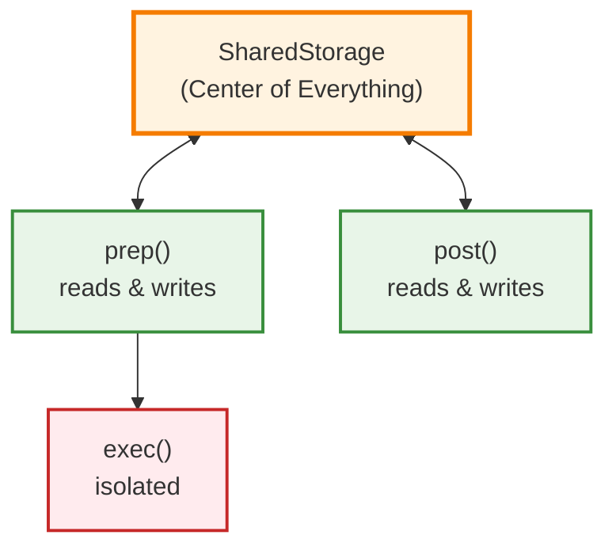

# Step-by-Step Tutorial Guide 📚

*Part 1: Foundation - Detailed Walkthrough*

This guide takes you through building your first AI components using the PocketFlow pattern. Follow along at your own pace!

> 🧠 **Remember Our Manifesto**: *"Complex AI systems are just simple ideas stacked together."* Today we'll prove this by transforming messy API calls into clean, reusable building blocks.

## 📚 Tutorial Overview

We'll build three progressive examples:
1. **Basic Chat Completion** - Learn the pattern
2. **Interactive Terminal Chat** - Apply the pattern  
3. **Framework Comparison** - See the evolution

## Step 1: Understanding the PocketFlow Pattern 🧱

Traditional AI code mixes everything together. PocketFlow separates concerns with a clear three-phase pattern:

```typescript
// ❌ Traditional approach - everything mixed together
async function chatbot(message: string) {
    const conversation = [];
    conversation.push({role: 'user', content: message});
    const response = await openai.complete(conversation);
    conversation.push({role: 'assistant', content: response});
    return conversation;
}

// ✅ PocketFlow approach - separated concerns
class ChatNode extends Node<SharedStorage> {
    // prep() runs first - it gets data ready for processing
    // SharedStorage is our "memory" - it persists across the entire conversation
    // We return Message[] which becomes the input to exec()
    async prep(shared: SharedStorage): Promise<Message[]> { 
        /* Extract & transform data from SharedStorage */ 
    }
    
    // exec() runs second - it does the main work (like calling the LLM)
    // It only sees what prep() returned, not the full SharedStorage
    // This isolation makes it easy to test and debug
    async exec(messages: Message[]): Promise<string> { 
        /* Process the data (isolated from storage) */ 
    }
    
    // post() runs last - it handles the results
    // It has access to SharedStorage again to save results
    // It can also access what prep() and exec() returned
    async post(shared: SharedStorage, prepResult: any, execResult: any): Promise<void> { 
        /* Load results back into SharedStorage */ 
    }
}
```

**🌉 Connecting the Dots**

**If you're coming from web development:** 
- prep() = Controller (handle request)
- exec() = Service (business logic)  
- post() = Response (send result)

**If you're coming from data science:**
- prep() = Data preprocessing
- exec() = Model inference
- post() = Post-processing results

**Key Insight:** This is like ETL (Extract, Transform, Load) for AI workflows - clean, testable, and scalable.

🔍 **Checkpoint**: Before continuing, make sure you understand:
- What SharedStorage represents (the "memory" of your AI system)
- Why we separate prep/exec/post (testability and clarity)
- How the three phases work together as a pipeline

> 🌱 **First Principles Thinking**: Each phase has ONE job. When you understand each simple piece, the complex system becomes clear.

Need clarification? See [JOIN_COMMUNITY.md](../JOIN_COMMUNITY.md) - fellow builders are ready to help!

## Step 2: Shared Storage - The Memory Center 🧠

Everything in PocketFlow revolves around the `SharedStorage` object that travels through your entire flow:

```typescript
type SharedStorage = {
    messages: Message[];  // Conversation history
    userMessage: string;  // Current user input
    // Later we might add: context, metadata, user_data, etc.
}
```

This is the "memory" of your AI system - the center of everything in PocketFlow.



**💡 Think of it like a notebook:**
- prep() reads the notebook and prepares data for processing
- exec() gets a copy of the prepared data (but can't modify the notebook)
- post() writes results back into the notebook

## Step 3: Building Your First ChatNode 🔧

Let's build a ChatNode step by step. Open `examples/basic-chat.ts` and follow along:

### The Complete Implementation

```typescript
// 🤖 PocketFlow Node that handles the chat completion
class ChatNode extends Node<SharedStorage> {
    private debug = process.env.DEBUG_CHAT === 'true';

    // 🎯 PREP: Transform SharedStorage into what exec() needs
    async prep(shared: SharedStorage): Promise<Message[]> {
        if (this.debug) console.log('🔍 PREP: Adding user message to conversation');
        
        // Add the user's message to our conversation history
        shared.messages.push({ role: 'user', content: shared.userMessage });
        
        if (this.debug) console.log(`🔍 PREP: Conversation now has ${shared.messages.length} messages`);
        
        // Return the full conversation - this becomes exec()'s input
        return shared.messages;
    }
    
    // ⚡ EXEC: Do the main work (isolated from SharedStorage)
    async exec(messages: Message[]): Promise<string> {
        if (this.debug) console.log('🔍 EXEC: Calling LLM with messages:', messages.length);
        
        try {
            const response = await callLLM(messages);
            if (this.debug) console.log('🔍 EXEC: Got response from LLM');
            return response;
        } catch (error) {
            console.error('❌ EXEC: LLM call failed:', error instanceof Error ? error.message : 'Unknown error');
            throw error;
        }
    }
    
    // 💾 POST: Handle the results and update SharedStorage
    async post(shared: SharedStorage, prepRes: unknown, execRes: unknown): Promise<string | undefined> {
        if (this.debug) console.log('🔍 POST: Storing AI response in SharedStorage');
        
        // Add AI response to shared storage for future conversations
        shared.messages.push({ 
            role: 'assistant', 
            content: execRes as string 
        });
        
        if (this.debug) console.log(`🔍 POST: Conversation now has ${shared.messages.length} messages`);
        
        // Return undefined to end the flow (no next node)
        return undefined;
    }
}
```

### Running Your First Example

**🚀 Try it yourself:**
```bash
# Run the basic chat completion example
npx tsx examples/basic-chat.ts

# Want to see what's happening step by step?
DEBUG_CHAT=true npx tsx examples/basic-chat.ts
```

**Expected output:**
```
🎓 Chat Completion - PocketFlow Basics

🏃 Running the flow...
📝 User message: "Explain the ETL process in a few sentences. Reply in markdown format."

💬 Conversation Result:
━━━━━━━━━━━━━━━━━━━━━━━━━━━━━━━━━━━━━━━━━━━━━━━━━━━
1. 👤 user: Explain the ETL process in a few sentences. Reply in markdown format.

2. 🤖 assistant: # ETL Process

**ETL** stands for **Extract, Transform, Load** - a fundamental data processing pattern:

- **Extract**: Pull data from various sources (databases, APIs, files)
- **Transform**: Clean, validate, and restructure the data as needed  
- **Load**: Insert the processed data into a target system (warehouse, database)

This pattern ensures data quality and consistency across systems.

✅ Tutorial complete!

💡 What just happened (the PocketFlow pattern):
   🎯 prep() - Added user message to SharedStorage
   ⚡ exec() - Called OpenAI with the conversation
   💾 post() - Stored AI response back in SharedStorage

🚀 Ready for interactive chat? Try: npx tsx examples/interactive-chat.ts
🔧 Want to see debug info? Try: DEBUG_CHAT=true npx tsx examples/basic-chat.ts
```

**What you'll notice:**
- The response shows how **prep** added your message to the conversation
- The **exec** phase called the LLM with the conversation history  
- The **post** phase stored the AI's response back in SharedStorage

🔍 **Checkpoint**: Before continuing, make sure you can:
- Run the example without errors
- Understand what each phase (prep/exec/post) does
- See how SharedStorage accumulates conversation state

## Step 4: From Single Chat to Interactive Conversation 💬

Now let's see how the same ChatNode powers an interactive conversation. The beauty of the pattern is that **the same node works for both single interactions and ongoing conversations**.

### The Terminal Chat Implementation

Open `examples/interactive-chat.ts` and you'll see:

```typescript
class TerminalChat {
    private shared: SharedStorage = { messages: [] };  // Persistent memory
    
    async processUserInput(input: string) {
        // Use the same ChatNode pattern for each interaction
        const response = await sendMessage(this.shared, input);
        // SharedStorage accumulates conversation history automatically!
    }
}
```

**Key insight**: The same ChatNode that handled one message can handle an entire conversation because SharedStorage persists between interactions.

### 🎬 Flow Visualization

Watch what happens step by step:

**First interaction:**
```
prep() → "Hello" added to SharedStorage → messages: [user: "Hello"]
  ↓
exec() → LLM processes [user: "Hello"] → returns "Hi there!"
  ↓  
post() → "Hi there!" added to SharedStorage → messages: [user: "Hello", assistant: "Hi there!"]
```

**Second interaction:**
```
prep() → "How are you?" added to SharedStorage → messages: [user: "Hello", assistant: "Hi there!", user: "How are you?"]
  ↓
exec() → LLM processes full conversation → returns "I'm doing well, thanks!"
  ↓  
post() → Response added → messages: [user: "Hello", assistant: "Hi there!", user: "How are you?", assistant: "I'm doing well, thanks!"]
```

**🚀 Try the interactive version:**
```bash
npx tsx examples/interactive-chat.ts
```

🔍 **Checkpoint**: Before continuing, make sure you understand:
- How the same ChatNode works for both examples
- Why SharedStorage accumulates conversation history
- How prep→exec→post keeps working regardless of complexity

> 🔄 **Building Systematically**: One pattern, infinite applications. This is how we'll build entire AI ecosystems - one reusable piece at a time.

### Expected Interactive Experience

```
🚀 Welcome to PocketFlow Terminal Chat!
💬 Type your messages and press Enter to chat with AI
🔚 Type "exit", "quit", or "bye" to end the conversation
📜 Type "history" to see the full conversation
🧹 Type "clear" to clear the conversation history
--------------------------------------------------

💬 You: Hello! How does PocketFlow work?
🤖 AI is thinking...
👤 You: Hello! How does PocketFlow work?
🤖 AI: PocketFlow works by organizing AI workflows into three clean phases: prep (organize data), exec (do the work), and post (handle results). This pattern makes your AI code more testable, debuggable, and reusable than traditional approaches.

💬 You: What's the benefit of SharedStorage?
🤖 AI is thinking...
👤 You: What's the benefit of SharedStorage?
🤖 AI: SharedStorage acts as the persistent memory of your AI system - it maintains conversation history, context, and state across multiple interactions, unlike stateless API calls that forget everything between requests.

💬 You: history
📜 Conversation History:
------------------------------
1. 👤 You: Hello! How does PocketFlow work?
2. 🤖 AI: PocketFlow works by organizing AI workflows...
3. 👤 You: What's the benefit of SharedStorage?  
4. 🤖 AI: SharedStorage acts as the persistent memory...
------------------------------

💬 You: exit
👋 Thanks for chatting! Goodbye!
```

**Key observation:** Notice how the AI remembers previous messages - this is **SharedStorage** in action!

## Step 5: Understanding the Pattern Benefits 🏆

### Why This Pattern Matters

```typescript
// ❌ Traditional mixed approach
async function traditionalChat(message: string) {
    // Everything mixed together - hard to test, debug, or extend
    const conversation = getConversation();
    conversation.push({role: 'user', content: message});
    const response = await openai.complete(conversation);
    conversation.push({role: 'assistant', content: response});
    saveConversation(conversation);
    return response;
}

// ✅ PocketFlow separated approach  
class ChatNode extends Node<SharedStorage> {
    async prep(shared) { 
        // Easy to test: just pass mock SharedStorage
        // Easy to debug: isolate data preparation issues
    }
    async exec(messages) { 
        // Easy to test: just pass mock messages
        // Easy to debug: isolate LLM call issues
    }
    async post(shared, prep, exec) { 
        // Easy to test: pass mock results
        // Easy to debug: isolate storage issues
    }
}
```

### The Pattern Enables

✅ **Testing**: Mock each phase independently  
✅ **Debugging**: Know exactly where failures occur  
✅ **Reusability**: Same node works in different flows  
✅ **Extensibility**: Add features without breaking existing code  
✅ **Clarity**: Each phase has a single responsibility  

## Step 6: Practice and Experimentation 🎪

**Ready to experiment?** Try these modifications:

### Quick Modifications

1. **Add timestamps**: 
```typescript
type Message = {
    role: 'user' | 'assistant';
    content: string;
    timestamp: Date; // Add this!
}
```

2. **Conversation limits**:
```typescript
async prep(shared: SharedStorage): Promise<Message[]> {
    // Add user message
    shared.messages.push({ role: 'user', content: shared.userMessage });
    
    // Keep only last 10 messages
    if (shared.messages.length > 10) {
        shared.messages = shared.messages.slice(-10);
    }
    
    return shared.messages;
}
```

3. **Debug mode**: 
```bash
DEBUG_CHAT=true npx tsx examples/basic-chat.ts
```

### Understanding Check

Before moving on, make sure you can answer:

1. **What happens if you remove the `post()` method?** (Try it!)
2. **How would you add a system message?** (Hint: always ensure it's first)
3. **Why is `exec()` isolated from SharedStorage?** (Think about testing)

**Want more challenges?** Check out [EXERCISES.md](./EXERCISES.md) for guided practice!

## 🎯 Summary: What You've Learned

By completing this tutorial, you now understand:

✅ **The PocketFlow Pattern**: prep→exec→post for clean AI workflows  
✅ **SharedStorage**: The "memory" that persists across interactions  
✅ **Node Reusability**: Same component works for single calls and conversations  
✅ **Error Handling**: How to build robust AI applications  
✅ **Framework Thinking**: How patterns enable scalable systems  

## 🚀 Ready for More?

**Next steps:**
1. **Practice**: Try the [EXERCISES.md](./EXERCISES.md) challenges
2. **Explore**: Read [CONCEPTS_DEEP_DIVE.md](./CONCEPTS_DEEP_DIVE.md) for framework evolution
3. **Build**: Apply the pattern to your own AI ideas
4. **Continue**: Move to Part 2 - Research Agent

**Questions or stuck?** Check [TROUBLESHOOTING.md](./TROUBLESHOOTING.md) or see [JOIN_COMMUNITY.md](../JOIN_COMMUNITY.md) for help!

> 📚 **Creating Lasting Value**: You're not just learning - you're building components that will power future AI applications. Share your progress in the community and inspire others!

---

[← **Back to Overview**](./README.md) | [**Deep Dive Concepts** →](./CONCEPTS_DEEP_DIVE.md) | [**Practice Exercises** →](./EXERCISES.md)
