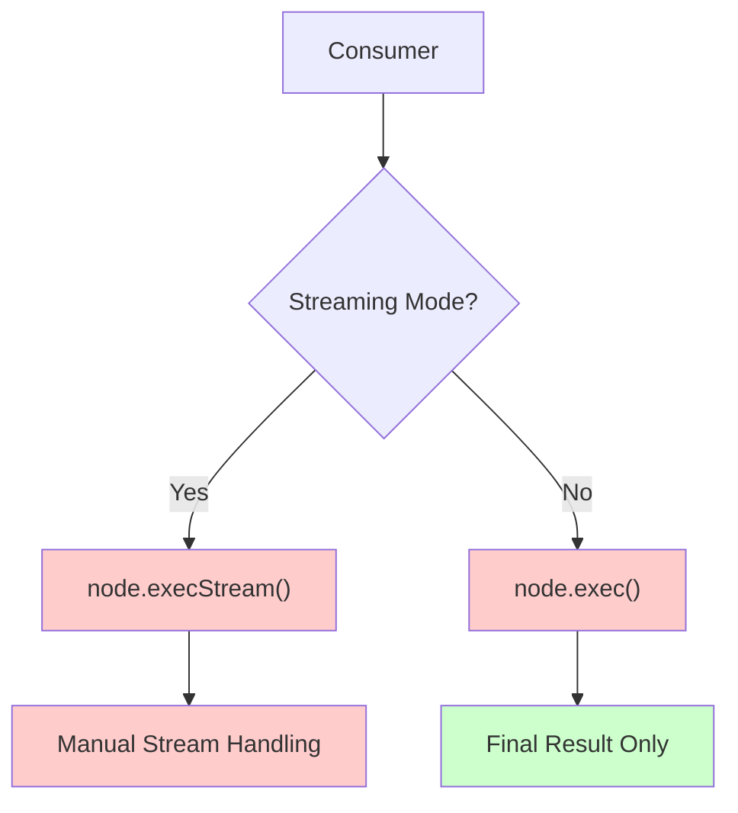
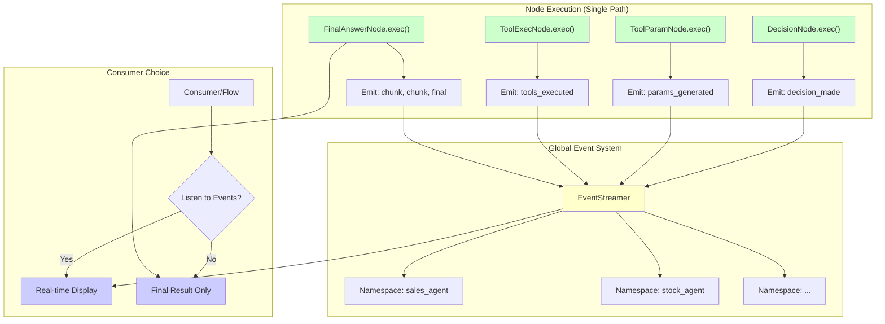

# Event-Driven Streaming Architecture

## Current Architecture (Problems)


**Problems:**
- Dual implementation (`exec` vs `execStream`)
- Different code paths for streaming vs non-streaming
- Complex manual stream orchestration
- Tight coupling between business logic and presentation

---

## Proposed Event-Driven Architecture


---

## Implementation Details

### 1. EventStreamer (Global)
```typescript
class EventStreamer {
    private static instance: EventStreamer;
    private emitter = new EventEmitter();
    
    static getInstance(): EventStreamer { /* singleton */ }
    
    emit(namespace: string, event: StreamEvent): void {
        this.emitter.emit(`${namespace}:${event.type}`, event);
    }
    
    subscribe(namespace: string, callback: (event: StreamEvent) => void): void {
        this.emitter.on(`${namespace}:*`, callback);
    }
}
```

### 2. Node Implementation (Single Path)
```typescript
class DecisionNode extends Node {
    async exec(prepRes: any): Promise<any> {
        // Emit progress event
        EventStreamer.getInstance().emit(this.namespace, {
            type: 'progress',
            content: { status: 'making_decision' }
        });
        
        // Do the actual work
        const result = await this.llmCall(prepRes);
        
        // Emit completion event
        EventStreamer.getInstance().emit(this.namespace, {
            type: 'decision_made',
            content: { decision: result.action, tool_requests: result.tool_requests?.length }
        });
        
        return result;
    }
}
```

### 3. Consumer Usage
```typescript
// Option 1: Streaming Mode
const streamer = EventStreamer.getInstance();
streamer.subscribe('sales_agent', (event) => {
    console.log(`[${event.type}]`, event.content);
});

await flow.run(sharedStorage); // Single execution path

// Option 2: Non-streaming Mode  
const result = await flow.run(sharedStorage); // Just get final result
console.log('Final result:', result);
```

---

## Key Benefits

### ✅ **Single Execution Path**
- Only `exec()` method needed
- Same business logic for streaming and non-streaming
- Eliminates code duplication

### ✅ **Opt-in Event Emission**
- Nodes can emit events if they want to provide progress
- No forced streaming implementation
- Backward compatible

### ✅ **Consumer Control**
- Consumer decides whether to listen to events
- Real-time display vs final result only
- Flexible presentation layer

### ✅ **Namespace Isolation**
- Multiple agents can run simultaneously
- Events are properly scoped
- No cross-contamination

### ✅ **Scalable Architecture**
- Event-driven is naturally scalable
- Easy to add new event types
- Clean separation of concerns

---

## Migration Path

1. **Create EventStreamer**: Global singleton event system
2. **Update Base Nodes**: Add event emission to existing `exec()` methods
3. **Remove execStream**: Delete all `execStream()` methods
4. **Update AgentNode**: Single execution path with event emission
5. **Update Consumers**: Choose between event listening or final results
