# Part 1: Foundation - From API Calls to Conversations 🎯

*Building AI from First Principles Series*

## 🧭 Start Here

Use this quick menu to navigate:

- [🎯 What You'll Learn](#what-youll-learn)
- [🎓 Prerequisites](#prerequisites)
- [🚀 Quick Start](#quick-start)
- [🧩 Basic Chat Explained](#basic-chat-explained)
- [🗺️ Learning Paths](#learning-paths)
- [🎪 Try It Now](#try-it-now)
- [🏗️ What We're Building](#what-were-building)
- [📚 Need More Help?](#need-more-help)
- [🤝 Join the Community](#join-the-community)

Recommended first steps:
1) Set your API key and run the basic example in [Quick Start](#quick-start)
2) Skim [STEP_BY_STEP.md](./STEP_BY_STEP.md) sections 1–2
3) If stuck, open [TROUBLESHOOTING.md](./TROUBLESHOOTING.md)

Then follow the 15‑minute walkthrough below.

Community & help: see [JOIN_COMMUNITY.md](../JOIN_COMMUNITY.md)

**Status: Complete ✅**

> 📦 **Using BackpackFlow in your own project?** Install it with `npm install backpackflow` and use the import syntax shown in the code comments. This tutorial uses local source files for learning purposes.

<a id="what-youll-learn"></a>
## 🎯 What You'll Learn

By the end of this part, you'll understand:

- **The PocketFlow Pattern** - How `prep → exec → post` makes AI code cleaner and more testable
- **Shared Storage Architecture** - How to maintain state across AI interactions  
- **Reusable Node Components** - Building blocks you can use in any AI project
- **From API to Conversation** - The difference between single completions and real chatbots

<a id="prerequisites"></a>
## 🎓 Prerequisites

**Essential:**
- Basic TypeScript/JavaScript (variables, functions, async/await)
- Node.js installed (v16+)
- Text editor (VS Code recommended)

**Helpful but not required:**
- Understanding of APIs and HTTP requests
- Experience with npm packages

**New to TypeScript?** No problem! We'll explain types as we go.

<a id="the-problem-were-solving"></a>
## 🚧 The Problem We're Solving

Most AI tutorials teach you to copy-paste API calls that quickly become unmaintainable:

```typescript
// ❌ The typical approach - everything mixed together
const conversation = [];

async function chatbot(message: string) {
    conversation.push({role: 'user', content: message});
    const response = await openai.complete(conversation);
    conversation.push({role: 'assistant', content: response});
    return conversation;
}
```

**What's wrong with this?**
- Hard to test individual pieces
- Error handling is mixed with business logic  
- Can't reuse parts in different contexts
- Becomes a mess as features grow

**Our solution:** The PocketFlow pattern that transforms chaos into clean, scalable components.

> 🧠 **Manifesto Moment**: *"Complex AI systems are just simple ideas stacked together."* Today, we'll take that chaotic API call and break it into three simple, reusable pieces.

<a id="quick-start"></a>
## 🚀 Quick Start

**Want to see the magic first?** Get up and running in 2 minutes:

```bash
# 1. Set your OpenAI API key
echo "OPENAI_API_KEY=your-key-here" > examples/.env

# 2. Try the basic example  
npx tsx examples/basic-chat.ts

# 3. Experience interactive chat
npx tsx examples/interactive-chat.ts
```

**Having issues?** Check [TROUBLESHOOTING.md](./TROUBLESHOOTING.md) for common problems and solutions.

### 📁 File Structure

```
01-foundations/
├── README.md                         # Overview & quick start (this file)
├── STEP_BY_STEP.md                   # Detailed tutorial walkthrough
├── CONCEPTS_DEEP_DIVE.md             # Advanced explanations & framework evolution
├── TROUBLESHOOTING.md                # Common issues & solutions
├── EXERCISES.md                      # Hands-on challenges & practice
└── examples/                         # All code examples
    ├── basic-chat.ts                 # Learn PocketFlow fundamentals
    ├── interactive-chat.ts           # Build interactive conversations
    └── framework-comparison.ts       # BackpackFlow framework example
```

<a id="15-minute-guided-walkthrough"></a>
## ⏱️ 15‑Minute Guided Walkthrough

Follow these steps for a smooth first run:

1. Run the basic example
   ```bash
   npx tsx examples/basic-chat.ts
   ```
   - You should see a short conversation printed
   - This demonstrates the prep → exec → post pattern end-to-end
   - Expected (preview):
     ```
     1. 👤 user: Explain the ETL process in a few sentences...
     2. 🤖 assistant: ETL stands for Extract, Transform, Load...
     ```

2. (Optional) Enable debug mode to see each phase
   ```bash
   DEBUG_CHAT=true npx tsx examples/basic-chat.ts
   ```
   - Watch PREP, EXEC, and POST logs to understand data flow

3. Try the interactive chat
   ```bash
   npx tsx examples/interactive-chat.ts
   ```
   - Type a message and see how SharedStorage keeps the history
   - Try the commands: `history`, `clear`, `exit`

4. Quick reflection checkpoint
   - What did PREP add to the conversation?
   - What did EXEC do without touching storage?
   - What did POST write back into storage?

If something breaks: open [TROUBLESHOOTING.md](./TROUBLESHOOTING.md). Want a deeper guided build? See [STEP_BY_STEP.md](./STEP_BY_STEP.md).

Need a hand or want to share progress? See [JOIN_COMMUNITY.md](../JOIN_COMMUNITY.md).

### Quick Checklist

- [ ] Ran `examples/basic-chat.ts`
- [ ] Tried `examples/interactive-chat.ts`
- [ ] Understand prep → exec → post at a high level
- [ ] Skimmed STEP_BY_STEP.md sections 1–2

If you checked these, you’re ready to continue.

<a id="basic-chat-explained"></a>
## 🧩 Basic Chat Explained

A quick look at how the pattern comes together in `examples/basic-chat.ts`.


1) Define message and storage types
```typescript
type Message = { role: 'user' | 'assistant'; content: string };
type SharedStorage = { messages: Message[]; userMessage: string };
```

2) Prep → Exec → Post
```typescript
class ChatNode extends Node<SharedStorage> {
    async prep(shared: SharedStorage): Promise<Message[]> {
    shared.messages.push({ role: 'user', content: shared.userMessage });
    return shared.messages; // input to exec()
    }
    async exec(messages: Message[]): Promise<string> {
    return await callLLM(messages); // isolated from storage
    }
  async post(shared: SharedStorage, _prep: unknown, execRes: unknown) {
        shared.messages.push({ role: 'assistant', content: execRes as string });
    }
}
```

3) Orchestrate with Flow
```typescript
const chatNode = new ChatNode();
const chatFlow = new Flow(chatNode);
const shared: SharedStorage = { messages: [], userMessage: 'Explain ETL briefly.' };
await chatFlow.run(shared);
```

4) Why this matters (phase-by-phase)
- **prep()**: Reads/writes SharedStorage; prepares clean input
- **exec()**: Pure work; easy to test/mock; no storage access
- **post()**: Writes results back; finalizes state

> 🧠 Manifesto in Action: One complex function → three simple, reusable ideas.

<a id="learning-outcomes"></a>
## 🎯 Learning Outcomes

By completing this part, you'll be able to:

✅ **Explain** why prep→exec→post is better than mixed concerns  
✅ **Build** a ChatNode that handles any conversation flow  
✅ **Debug** AI workflows by isolating which phase has issues  
✅ **Extend** the pattern to add features like conversation limits  
✅ **Apply** the same pattern to different types of AI tasks

<a id="learning-paths"></a>
## 🗺️ Learning Paths

Choose your adventure based on your learning style:

### 🏃‍♂️ **Quick Learner** (15 minutes)
1. Run the examples above
2. Read [STEP_BY_STEP.md](./STEP_BY_STEP.md) sections 1-2
3. Try one exercise from [EXERCISES.md](./EXERCISES.md)

### 🧠 **Deep Learner** (45 minutes)  
1. Run examples with debug mode: `DEBUG_CHAT=true npx tsx examples/basic-chat.ts`
2. Read full [STEP_BY_STEP.md](./STEP_BY_STEP.md) guide
3. Read [CONCEPTS_DEEP_DIVE.md](./CONCEPTS_DEEP_DIVE.md) for framework thinking
4. Complete beginner exercises

### 🔧 **Hands-On Learner** (60 minutes)
1. Run examples and immediately start modifying code
2. Jump to [EXERCISES.md](./EXERCISES.md) for guided challenges
3. Reference [STEP_BY_STEP.md](./STEP_BY_STEP.md) when you get stuck
4. Check [CONCEPTS_DEEP_DIVE.md](./CONCEPTS_DEEP_DIVE.md) for "why" questions

<a id="try-it-now"></a>
## 🎪 Try It Now

**Ready to experiment?** Here are quick modifications to try:

1. **Add timestamps**: Modify the Message type to include `timestamp: Date`
2. **Debug mode**: Enable `DEBUG_CHAT=true npx tsx examples/basic-chat.ts` to see step-by-step execution
3. **Conversation limits**: Prevent conversations from getting too long

**Want more challenges?** Check out [EXERCISES.md](./EXERCISES.md) for guided practice!

> 🏗️ **Building Block Mindset**: Each modification you make is a *simple idea* that could become part of a more complex system. Save your experiments - they might inspire your next big project!

<a id="what-were-building"></a>
## 🏗️ What We're Building

You'll see the evolution from simple API calls to framework components:

```mermaid
graph LR
    A["API Call"] --> B["PocketFlow Node"] --> C["Framework Component"]
    A --> D["❌ Mixed concerns<br/>❌ Hard to test<br/>❌ Not reusable"]
    B --> E["✅ Clean separation<br/>✅ Easy to test<br/>✅ Modular design"]
    C --> F["✅ Vendor independent<br/>✅ Production ready<br/>✅ Community shared"]
    
    classDef problem fill:#ffebee,stroke:#c62828,stroke-width:2px
    classDef solution fill:#e8f5e8,stroke:#388e3c,stroke-width:2px
    classDef benefit fill:#e3f2fd,stroke:#1976d2,stroke-width:2px
    
    class D problem
    class E,F solution
```



<a id="whats-next"></a>
## 🚀 What's Next

**Congratulations!** You've mastered the foundation of AI development. Here's what you can do now:

### Immediate Next Steps
1. **Practice**: Try the challenges in [EXERCISES.md](./EXERCISES.md)
2. **Experiment**: Modify the examples to suit your needs
3. **Build**: Apply the pattern to your own AI ideas

### Continue Learning: Part 2
In **Part 2: Research Agent**, you'll use these components to create multi-step intelligent workflows that can:
- 🔍 Search the web for information
- 🧠 Analyze and synthesize findings  
- 🤖 Make intelligent decisions
- 🔗 Chain multiple AI operations together

<a id="join-the-community"></a>
### Join the Community

🎓 **Connect with Fellow Builders**: See [JOIN_COMMUNITY.md](../JOIN_COMMUNITY.md) to:
- **Share your progress** - Show off your modifications and creations
- **Get help when stuck** - Experienced builders ready to help
- **Give feedback** - Help improve this tutorial series
- **Shape the future** - Suggest new features and directions
- **Build together** - Collaborate on the BackpackFlow library

> 🤝 **Manifesto in Action**: *"Share the journey"* - Your questions, insights, and contributions make this series better for everyone!

<a id="need-more-help"></a>
## 📚 Need More Help?

- **Stuck on concepts?** → [STEP_BY_STEP.md](./STEP_BY_STEP.md)
- **Want deeper understanding?** → [CONCEPTS_DEEP_DIVE.md](./CONCEPTS_DEEP_DIVE.md)  
- **Having technical issues?** → [TROUBLESHOOTING.md](./TROUBLESHOOTING.md)
- **Ready to practice?** → [EXERCISES.md](./EXERCISES.md)

---

[← **Series Overview**](../README.md) | [**Next: Part 2 - Research Agent** →](../02-research-agent/)

*Built with ❤️ using PocketFlow and BackpackFlow*

<!-- Learning Progress removed in favor of the Quick Checklist after the walkthrough to maintain flow -->
