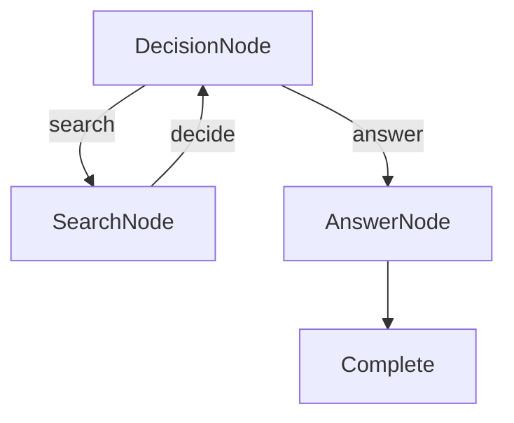

# Research Agent

A TypeScript implementation of an intelligent LLM-powered research agent using PocketFlow and Instructor.js. This agent can search the web, make decisions about when to research vs. answer, and provide comprehensive responses.

## Features

- **Intelligent Decision Making**: Uses structured output to decide between searching and answering
- **High-Quality Web Search**: Uses Exa.ai for accurate, up-to-date search results with content extraction
- **Iterative Research**: Can perform multiple searches before providing a final answer
- **Type-Safe**: Full TypeScript implementation with Zod schema validation
- **Structured Output**: Uses Instructor.js for reliable JSON responses

## Quick Setup & Run

1. **Install dependencies:**
    ```bash
    npm install
    ```

2. **Set your API keys:**
    ```bash
    export OPENAI_API_KEY="your-openai-api-key-here"
    export EXA_API_KEY="your-exa-api-key-here"
    ```
    
    Or create a `.env` file:
    ```bash
    echo "OPENAI_API_KEY=your-openai-api-key-here" > .env
    echo "EXA_API_KEY=your-exa-api-key-here" >> .env
    ```
    
    **Note:** Get your Exa API key from [exa.ai](https://exa.ai) - it provides much higher quality search results than traditional search APIs.

3. **Test the setup:**
    ```bash
    npm run test
    ```
    This will test both the LLM call and web search features to ensure everything is working.

4. **Run with default question (Nobel Prize winners):**
    ```bash
    npm start
    ```

5. **Ask your own questions:**
    ```bash
    npm start "What is quantum computing?"
    npm start "Latest developments in renewable energy"
    npm start "How does artificial intelligence impact healthcare?"
    ```

## How It Works

The agent uses a decision-based graph structure with three main components working together:



### Agent Components:

1. **🧠 DecisionNode**: Analyzes the question and research context to decide whether to search for more information or provide an answer
2. **🔍 SearchNode**: Performs targeted web searches to gather relevant information about the topic
3. **📝 AnswerNode**: Synthesizes all gathered information into a comprehensive, well-structured answer

Each node uses structured output (JSON) via Instructor.js to ensure reliable communication between components.

## What You'll See

Example interaction for "What is quantum computing?":

```
🤖 Research Agent - PocketFlow + Instructor
==========================================
Question: What is quantum computing?

🧠 Analyzing question and deciding next action...
📋 Decision: SEARCH
💭 Reasoning: Need to gather current information about quantum computing fundamentals and applications

🔍 Searching for: quantum computing fundamentals applications 2024
✨ Found 5 relevant results

🧠 Analyzing gathered information...
📋 Decision: SEARCH  
💭 Reasoning: Need more specific information about quantum computing advantages and current limitations

🔍 Searching for: quantum computing advantages limitations current state
✨ Found 6 relevant results

🧠 Analyzing comprehensive information...
📋 Decision: ANSWER
💭 Reasoning: Have sufficient information to provide comprehensive answer about quantum computing

📝 Generating final answer...

📄 Final Answer:
===============

# Understanding Quantum Computing

Quantum computing represents a revolutionary approach to computation that leverages quantum mechanical phenomena...

[Comprehensive answer based on research findings]

===================
✅ Research Complete!

📊 Research Statistics:
- Searches performed: 2
- Total sources gathered: 11
- Research depth: Comprehensive
- Final answer length: 1,247 words
```

## Key Learning Points

1. **Decision-Based Workflows**: See how AI agents make autonomous decisions about their next actions
2. **Iterative Research**: Understand how agents can perform multiple research cycles
3. **Structured Agent Communication**: Learn how Zod schemas enable reliable agent-to-agent communication
4. **Web Search Integration**: See how to integrate external APIs into PocketFlow workflows
5. **Context Accumulation**: Observe how agents build and maintain research context across iterations

## API Usage

Use the research agent in your own applications:

```typescript
import { runResearchAgent } from './main';

const result = await runResearchAgent("Your research question here");
console.log(result.finalAnswer);
console.log(`Performed ${result.searchCount} searches`);
```

## Customization

### Modify Search Behavior

Adjust the search criteria in `DecisionNode`:

```typescript
// In DecisionNode schema
const DecisionSchema = z.object({
  action: z.enum(["search", "answer"]),
  reasoning: z.string(),
  search_query: z.string().optional(), 
  confidence: z.number().min(0).max(1) // Add confidence scoring
});
```

### Customize Answer Format

Modify the `AnswerSchema` for different output formats:

```typescript
const AnswerSchema = z.object({
  title: z.string().describe("Engaging title for the research findings"),
  summary: z.string().describe("Executive summary (2-3 sentences)"),
  main_content: z.string().describe("Detailed analysis and findings"),
  key_points: z.array(z.string()).describe("List of key takeaways"),
  sources_count: z.number().describe("Number of sources used")
});
```

### Adjust Research Depth

Control how thorough the research should be:

```typescript
// In DecisionNode logic
const MAX_SEARCHES = 3; // Limit search iterations
const MIN_SOURCES = 5;  // Minimum sources before allowing answer
```

## Advanced Features

### Save Research Reports

```typescript
import fs from 'fs';

const result = await runResearchAgent("Your question");
const report = {
  question: "Your question",
  searches: result.searches,
  answer: result.finalAnswer,
  timestamp: new Date().toISOString()
};

fs.writeFileSync(`research-${Date.now()}.json`, JSON.stringify(report, null, 2));
```

### Batch Research

```typescript
const questions = [
  "What is quantum computing?",
  "How does blockchain work?", 
  "What are the latest AI developments?"
];

for (const question of questions) {
  const result = await runResearchAgent(question);
  console.log(`Research complete for: ${question}`);
}
```

## Files

- [`main.ts`](./main.ts): Complete research agent implementation - All nodes, flow logic, and execution
- [`utils.ts`](./utils.ts): Shared utilities - Instructor client and Exa.ai web search integration
- [`package.json`](./package.json): Node.js package configuration
- [`tsconfig.json`](./tsconfig.json): TypeScript compilation settings

## Technical Implementation

This research agent demonstrates several advanced PocketFlow patterns:

- **Conditional Node Routing**: Nodes decide their next destination based on structured output
- **Iterative Workflows**: Loops back to gather more information when needed
- **External API Integration**: Combines LLM reasoning with Exa.ai's advanced search capabilities
- **Context Preservation**: Maintains research context across multiple iterations
- **Structured Decision Making**: Uses schemas to ensure reliable agent decisions

The agent showcases how PocketFlow can be used to build sophisticated, autonomous AI workflows that make intelligent decisions about their own execution path.
