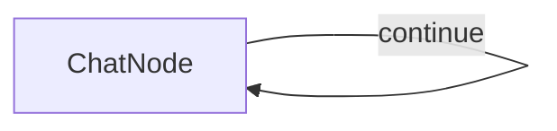

#  Simple PocketFlow Chat

A basic chat application using PocketFlow with OpenAI's GPT-4o model, written in TypeScript.

## Features

- Conversational chat interface in the terminal
- Maintains full conversation history for context
- Simple implementation demonstrating PocketFlow's node and flow concepts
- Standalone package that can run independently

## Quick Setup & Run

1. **Install dependencies:**
    ```bash
    npm install
    ```

2. **Set your OpenAI API key:**
    ```bash
    export OPENAI_API_KEY="your-api-key-here"
    ```
    
    Or create a `.env` file:
    ```bash
    echo "OPENAI_API_KEY=your-api-key-here" > .env
    ```

3. **Run the chat:**
    ```bash
    npm start
    ```

## How It Works



The chat application uses:
- A single `ChatNode` with a self-loop that demonstrates all three PocketFlow methods:
  - **`prep()`**: Takes user input from terminal, adds it to conversation history, returns messages for processing (or null to exit)
  - **`exec()`**: Receives the messages and calls OpenAI's GPT-4o API to generate a response
  - **`post()`**: Displays the AI response to user, adds it to conversation history, returns "continue" to loop back (or undefined to end)
- The flow continues until the user types 'exit', demonstrating how PocketFlow nodes can create interactive loops


## Files

- [`main.ts`](./main.ts): Implementation of the ChatNode and chat flow using PocketFlow
- [`utils.ts`](./utils.ts): Simple wrapper for calling the OpenAI API
- [`package.json`](./package.json): Node.js package configuration with dependencies
- [`tsconfig.json`](./tsconfig.json): TypeScript compilation settings
 