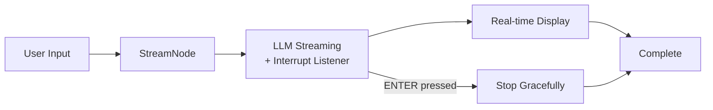

# PocketFlow LLM Streaming Tutorial

!!! NOT COMPLETE

Real-time streaming of Large Language Model responses with user interruption capabilities using PocketFlow and TypeScript. Perfect for building responsive chat applications and interactive AI systems.

## Features

- **Real-Time Response Streaming**: See LLM-generated content appear character-by-character as it's being produced
- **User Interruption**: Press ENTER at any time to gracefully stop the streaming process
- **Production-Ready**: Full TypeScript implementation with proper error handling
- **Flexible Integration**: Easy to integrate into web applications, CLIs, or other interactive systems
- **Memory Efficient**: Streams responses without loading entire content into memory

## Quick Setup & Run

1. **Install dependencies:**
    ```bash
    npm install
    ```

2. **Set your OpenAI API key:**
    ```bash
    export OPENAI_API_KEY="your-api-key-here"
    ```
    
    Or create a `.env` file:
    ```bash
    echo "OPENAI_API_KEY=your-api-key-here" > .env
    ```

3. **Test streaming (fake/demo mode):**
    ```bash
    npm run demo
    ```

4. **Run with real OpenAI streaming:**
    ```bash
    npm start
    ```

5. **Try different prompts:**
    ```bash
    npm start "Write a story about space exploration"
    npm start "Explain quantum computing in simple terms"
    ```

## How It Works



**Simple concept:** Stream LLM responses in real-time while allowing users to interrupt anytime by pressing ENTER.

### Key Components

#### 🌊 **StreamNode**
Manages the streaming lifecycle with three main phases:
- **`prep()`**: Set up interrupt listener and prepare the prompt for streaming
- **`exec()`**: Stream LLM response chunks in real-time while monitoring for interruptions
- **`post()`**: Clean up resources and display completion status

#### ⚡ **Real-Time Processing**
- Uses OpenAI's streaming API to get response chunks immediately
- Displays content character-by-character for smooth user experience
- Maintains responsiveness even during long responses

#### 🛑 **Interrupt System**
- Non-blocking input listener using readline interface
- Graceful cancellation that doesn't corrupt partial responses
- Clean resource cleanup when interrupted

## Example Output

```
🌊 PocketFlow LLM Streaming Demo
===============================

Enter your prompt (or press ENTER for default): Write a short poem about TypeScript

🤖 Streaming response... (Press ENTER to interrupt)
┌─────────────────────────────────────────────┐
│ In the realm of code where types hold sway, │
│ TypeScript guides us along the way.         │
│ With interfaces clean and functions true,   │
│ It catches our errors before they're due.   │
│                                             │
│ No more the chaos of JavaScript's dance,    │
│ Type safety gives our code a chance...      │
└─────────────────────────────────────────────┘

✅ Stream completed successfully!
📊 Stats: 156 characters streamed in 3.2 seconds
```

## API Usage

You can also use the streaming functionality programmatically:

```typescript
import { StreamNode } from './main';

// Basic streaming
const streamNode = new StreamNode();
const result = await streamNode.streamResponse("Your prompt here");

// With custom interrupt handling
const customStreamNode = new StreamNode({
  onInterrupt: () => console.log("Stream was interrupted!"),
  onChunk: (chunk) => console.log("Received:", chunk),
  onComplete: (fullText) => console.log("Final result:", fullText)
});
```

## Customization

### Streaming Behavior
Modify streaming parameters in `main.ts`:
```typescript
const response = await openai.chat.completions.create({
  model: 'gpt-4',
  messages: [{ role: 'user', content: prompt }],
  stream: true,
  temperature: 0.7,        // Adjust creativity
  max_tokens: 1000,        // Limit response length
  presence_penalty: 0.1    // Reduce repetition
});
```

### Display Formatting
Customize the visual presentation:
```typescript
// Change streaming display style
process.stdout.write(`\x1b[32m${chunk}\x1b[0m`); // Green text
process.stdout.write(`\x1b[1m${chunk}\x1b[0m`);  // Bold text

// Add custom borders or formatting
console.log(`╭─ ${timestamp} ─╮`);
console.log(`│ ${chunk} │`);
console.log(`╰─────────╯`);
```

### Interrupt Handling
Add custom interrupt logic:
```typescript
private setupInterruptListener(): void {
  this.rl.on('line', () => {
    this.interrupted = true;
    console.log('\n🛑 Stream interrupted by user');
    // Custom cleanup logic here
    this.cleanup();
  });
}
```

## Advanced Usage

### Web Integration
Stream to web clients using Server-Sent Events:
```typescript
// Express.js example
app.get('/stream', async (req, res) => {
  res.setHeader('Content-Type', 'text/event-stream');
  const streamNode = new StreamNode({
    onChunk: (chunk) => res.write(`data: ${JSON.stringify({chunk})}\n\n`)
  });
  await streamNode.streamResponse(req.query.prompt);
  res.end();
});
```

### Batch Processing
Stream multiple responses in sequence:
```typescript
const prompts = ["Question 1", "Question 2", "Question 3"];
for (const prompt of prompts) {
  console.log(`\n--- Streaming: ${prompt} ---`);
  await streamNode.streamResponse(prompt);
}
```

## Files

- [`main.ts`](./main.ts): StreamNode implementation and flow orchestration
- [`utils.ts`](./utils.ts): OpenAI streaming utilities and demo functions
- [`package.json`](./package.json): Node.js package configuration
- [`tsconfig.json`](./tsconfig.json): TypeScript compilation settings

## Technical Implementation

This streaming tutorial demonstrates several advanced patterns:

- **Asynchronous Stream Processing**: Handle real-time data streams with proper backpressure
- **Concurrent Input Monitoring**: Listen for user input while processing streams
- **Resource Management**: Clean up streams and listeners to prevent memory leaks
- **Error Recovery**: Graceful handling of network interruptions and API errors
- **User Experience**: Smooth, responsive interfaces that feel immediate and interactive

The implementation showcases how PocketFlow can handle complex, real-time scenarios while maintaining clean, readable code structure.

## Use Cases

This streaming pattern is perfect for:

- **Interactive Chatbots**: Immediate response feedback in conversations
- **Code Generation Tools**: See generated code appear in real-time
- **Content Creation**: Watch articles, stories, or documentation being written
- **Educational Assistants**: Stream explanations and tutorials progressively
- **Creative Writing**: Real-time story generation and collaborative writing

Ready to build responsive, streaming AI applications with PocketFlow! 🚀
