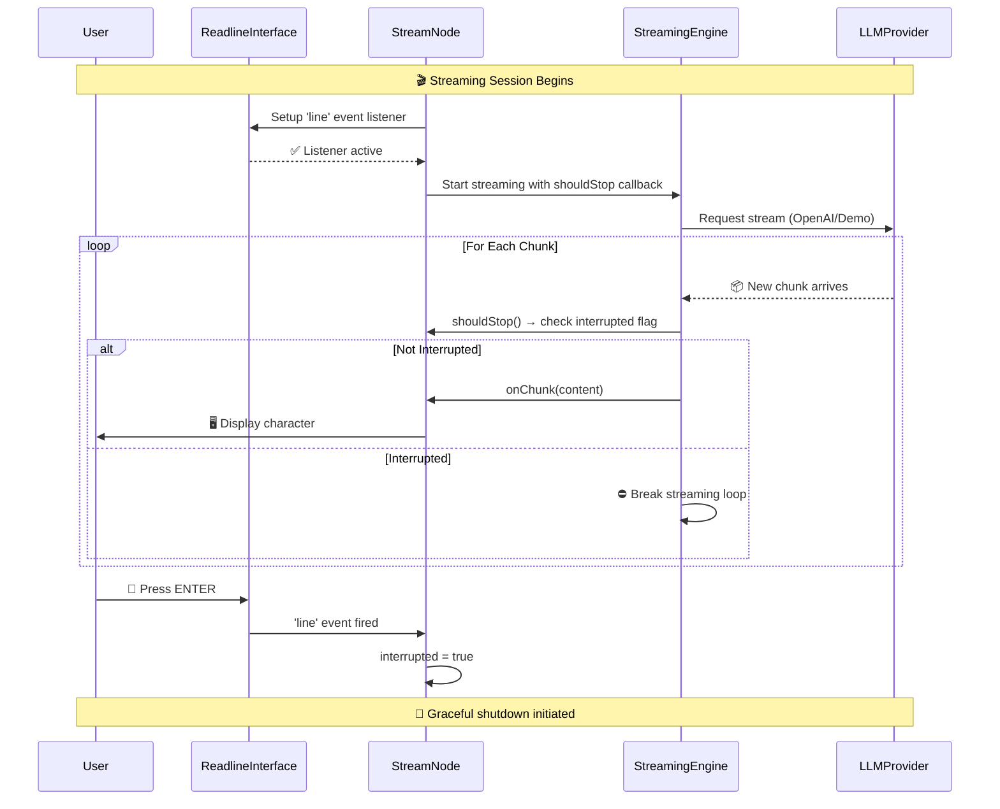
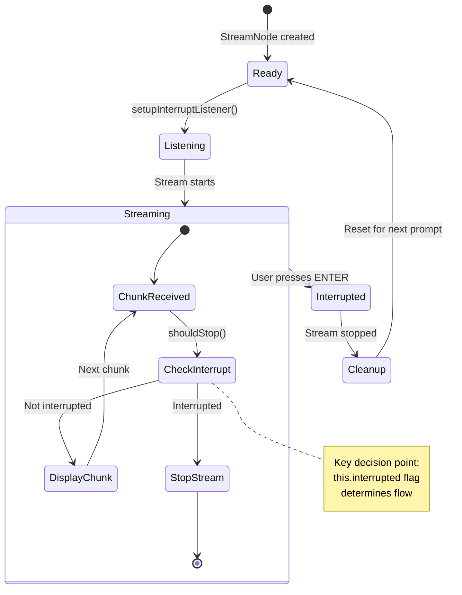

# StreamNode Architecture: Interrupt System & Chunk Streaming

## 🎯 Overview

The StreamNode implements a sophisticated real-time streaming system with graceful interruption capabilities. Here's how the interrupt events are set up and chunks are streamed.

## 📊 Architecture Diagram

```mermaid
graph TB
    subgraph "🎮 User Interface Layer"
        A[Terminal/Console] 
        B[User Input: ENTER key]
        C[Visual Output: Character Stream]
    end
    
    subgraph "🧠 StreamNode Core"
        D[StreamNode Instance]
        E[readline.Interface]
        F[interrupted: boolean flag]
        G[setupInterruptListener()]
    end
    
    subgraph "🌊 Streaming Engine"
        H[streamLLMResponse() / demoStreamResponse()]
        I[OpenAI Stream Iterator]
        J[shouldStop() callback]
        K[onChunk() callback]
    end
    
    subgraph "🔄 Event Flow"
        L[Line Event Listener]
        M[Interrupt Signal]
        N[Chunk Processing Loop]
        O[Display Controller]
    end
    
    %% User Interaction Flow
    A --> B
    B --> L
    L --> M
    M --> F
    
    %% Interrupt Setup Flow  
    D --> E
    D --> F
    D --> G
    G --> L
    
    %% Streaming Flow
    D --> H
    H --> I
    I --> N
    N --> J
    J --> F
    N --> K
    K --> O
    O --> C
    
    %% Feedback Loop
    F --> J
    F --> N
    
    style A fill:#e1f5fe
    style D fill:#f3e5f5
    style H fill:#e8f5e8
    style F fill:#fff3e0
```

## 🔧 Detailed Component Analysis

### 1. **Interrupt System Setup**

```typescript
// 📍 In constructor - Create readline interface
this.rl = readline.createInterface({
  input: process.stdin,
  output: process.stdout
});

// 📍 In prep() - Setup interrupt listener
private setupInterruptListener(shared: SharedState): void {
  this.rl.on('line', () => {
    if (!this.interrupted) {
      this.interrupted = true;           // 🚩 Set local flag
      shared.interrupted = true;         // 🚩 Set shared flag  
      console.log('\n🛑 Interrupt signal received...');
    }
  });
}
```

### 2. **Streaming & Interrupt Coordination**



## 🎯 Key Components Breakdown

### **🎮 Interrupt Event System**

```typescript
// 1️⃣ Event Listener Registration
this.rl.on('line', () => {
  // Fired when user presses ENTER
});

// 2️⃣ Flag-Based Communication
private interrupted: boolean = false;  // Instance-level flag
shared.interrupted = true;             // Shared state flag

// 3️⃣ Callback Integration
shouldStop: () => this.interrupted    // Passed to streaming function
```

### **🌊 Chunk Streaming Pipeline**

```typescript
// 1️⃣ Stream Source (Real or Demo)
const stream = await openai.chat.completions.create({ stream: true });

// 2️⃣ Async Iterator Loop
for await (const chunk of stream) {
  // 3️⃣ Interrupt Check
  if (options.shouldStop && options.shouldStop()) {
    break; // 🛑 Exit gracefully
  }
  
  // 4️⃣ Content Extraction
  const content = chunk.choices[0]?.delta?.content || '';
  
  // 5️⃣ Chunk Processing
  if (content && options.onChunk) {
    options.onChunk(content); // 📺 Display immediately
  }
}
```

## 🔄 Execution Flow Timeline

```mermaid
gantt
    title StreamNode Execution Timeline
    dateFormat X
    axisFormat %s
    
    section Setup Phase
    Create readline interface    :0, 1
    Setup interrupt listener     :1, 2
    Initialize flags            :1, 2
    
    section Streaming Phase  
    Start LLM stream            :2, 3
    Chunk 1 arrives & displays :3, 4
    Chunk 2 arrives & displays :4, 5
    Chunk 3 arrives & displays :5, 6
    User presses ENTER          :6, 7
    Interrupt flag set          :7, 8
    Stream stops gracefully     :8, 9
    
    section Cleanup Phase
    Display statistics          :9, 10
    Ask continue prompt         :10, 11
    Remove event listeners      :11, 12
```



## 🎪 Demo vs Real Streaming

### **🎭 Demo Mode (Simulated)**
```typescript
// Character-by-character simulation
for (let i = 0; i < demoText.length; i++) {
  if (options.shouldStop && options.shouldStop()) break;
  
  const char = demoText[i];
  if (options.onChunk) options.onChunk(char);
  
  await new Promise(resolve => setTimeout(resolve, 20)); // 20ms delay
}
```

### **🤖 Real Mode (OpenAI)**
```typescript
// Real-time streaming from OpenAI
for await (const chunk of stream) {
  if (options.shouldStop && options.shouldStop()) break;
  
  const content = chunk.choices[0]?.delta?.content || '';
  if (content && options.onChunk) {
    options.onChunk(content); // No artificial delay
  }
}
```

## 🚦 State Management



## 🎯 Critical Design Patterns

### **1. Non-Blocking Input Monitoring**
- Readline interface runs independently of streaming
- Event-driven interrupt detection
- No polling or blocking operations

### **2. Flag-Based Coordination** 
- Simple boolean flags for state communication
- Both instance-level and shared-state flags
- Clean separation of concerns

### **3. Callback-Driven Streaming**
- `shouldStop()` - Interrupt checking callback
- `onChunk()` - Real-time display callback  
- `onComplete()` - Completion notification

### **4. Graceful Resource Cleanup**
- Event listener removal in `cleanup()`
- Promise resolution for pending operations
- Memory leak prevention

## 🚀 Performance Characteristics

- **⚡ Real-time Display**: Characters appear as soon as received
- **🎯 Low Latency**: Minimal delay between chunks (20ms demo, 0ms real)
- **💾 Memory Efficient**: Streaming without buffering entire response  
- **🛡️ Interrupt Responsive**: Immediate response to user input (<50ms)
- **🧹 Resource Safe**: Proper cleanup prevents memory leaks

This architecture enables responsive, interactive AI applications with professional-grade user experience! 🌊✨
