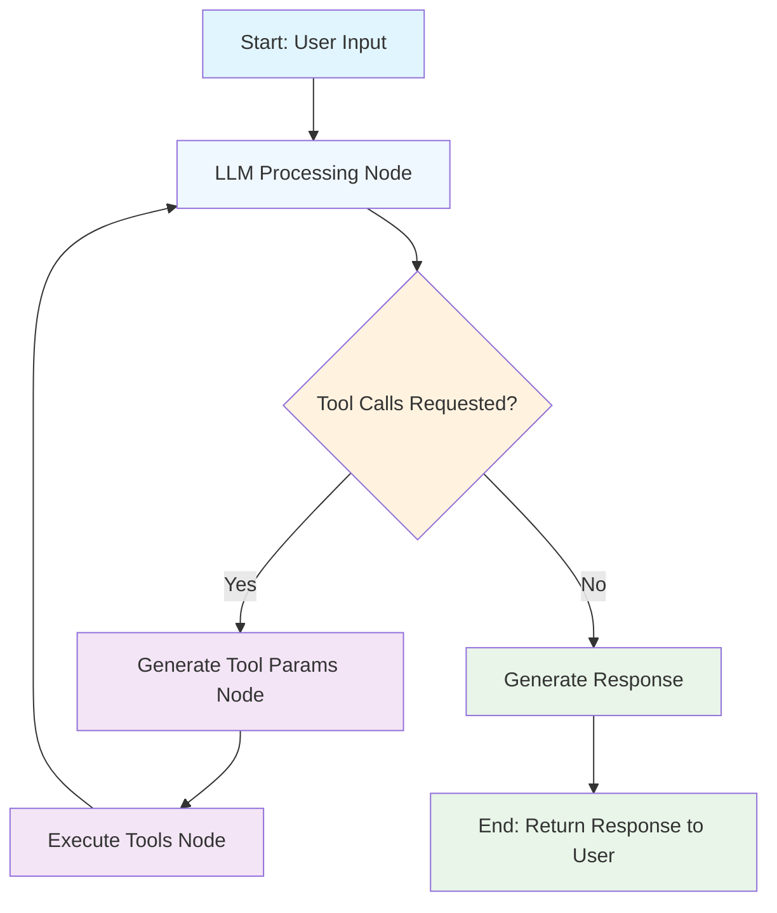

# Simple Sales Agent with MCP Integration

This tutorial demonstrates how to build a conversational sales agent using PocketFlow with MCP (Model Context Protocol) tool integration.

## Architecture Flow

The agent follows a dynamic tool execution flow where the LLM can make multiple tool calls in sequence:



## Key Components

### 1. **SalesAgent Node**
- Main orchestrator that handles user input
- Manages conversation flow and system prompts
- Integrates with MCP server manager

### 2. **Tool Parameter Generation Node**
- Analyzes LLM tool call requests
- Generates appropriate parameters for tool execution
- Validates tool availability

### 3. **Tool Execution Node**
- Executes MCP tools with generated parameters
- Handles tool results and error cases
- Formats results for LLM consumption

### 4. **Response Generation Node**
- Processes final LLM response
- Handles cases with and without tool usage
- Formats output for user

## MCP Integration Features

- **Dynamic Tool Discovery**: Automatically discovers available tools from MCP servers
- **Multi-Tool Support**: Can execute multiple tools in sequence
- **Error Handling**: Graceful handling of tool execution failures
- **Session Management**: Maintains conversation context across tool calls

## Tool Execution Loop

The agent implements a node-based tool execution loop:

1. **LLM Processing Node**: Process user input and determine which tools to call
2. **Generate Tool Params Node**: Extract and prepare tool parameters from LLM response
3. **Execute Tools Node**: Execute tools via MCP server manager and return results
4. **Loop Back**: Tool results go back to LLM Processing Node for next iteration
5. **Generate Response**: When no more tools needed, generate final response

## Usage

```bash
# Install dependencies
npm install

# Set up environment
cp env.example .env
# Add your OPENAI_API_KEY to .env

# Run the sales agent
npx ts-node main.ts
```

## Configuration

The agent supports multiple MCP server configurations:

- **Local stdio servers**: For file system, database operations
- **Remote SSE servers**: For web APIs with bearer token authentication
- **Mixed environments**: Combine local and remote tools seamlessly

This architecture enables building sophisticated AI agents that can dynamically use real-world tools while maintaining clean separation of concerns through PocketFlow's node-based architecture.
