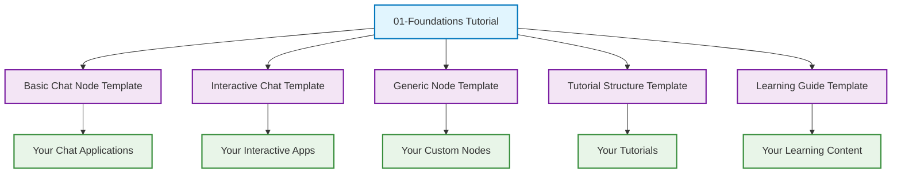

# Templates Index 📚

*Reusable Templates Created from the 01-Foundations Tutorial Series*

This collection of templates captures the successful patterns and structures from the 01-foundations tutorial, making them reusable for creating new educational content and PocketFlow applications.

## 🎯 Available Templates

### 🤖 Code Templates

#### 1. **Basic Chat Node Template** (`basic-chat-node-template.ts`)
**Purpose**: Create a simple chat completion node following the PocketFlow prep→exec→post pattern

**When to use**:
- Building your first PocketFlow node
- Creating chat functionality for any application
- Learning the three-phase pattern

**What it includes**:
- Complete ChatNode implementation with detailed comments
- LLM provider abstraction (customizable for any provider)
- Error handling and debugging support
- Usage example and customization guidance

**Quick start**:
```bash
cp basic-chat-node-template.ts your-chat-node.ts
# Edit the TODO sections for your specific needs
```

#### 2. **Interactive Chat Template** (`interactive-chat-template.ts`)
**Purpose**: Build a complete terminal chat application with persistent conversation

**When to use**:
- Creating interactive AI applications
- Building chat interfaces with command support
- Demonstrating PocketFlow in action

**What it includes**:
- Complete terminal interface with readline integration
- Built-in commands (history, clear, help, exit)
- Persistent conversation state management
- Error recovery and user experience features

**Features**:
- ✅ Interactive terminal interface
- ✅ Conversation history management
- ✅ Built-in command system
- ✅ Error handling and recovery
- ✅ Customizable prompts and behavior

#### 3. **Generic PocketFlow Node Template** (`generic-pocketflow-node-template.ts`)
**Purpose**: Create any type of PocketFlow node for any use case

**When to use**:
- Building custom nodes for specific tasks
- Understanding the prep→exec→post pattern deeply
- Creating reusable components for larger systems

**What it includes**:
- Complete node implementation with comprehensive documentation
- Testing utilities and performance benchmarking
- Helper methods and validation patterns
- Multiple usage examples and customization points

**Advanced features**:
- ✅ Phase-by-phase testing utilities
- ✅ Performance benchmarking tools
- ✅ Comprehensive error handling patterns
- ✅ Production-ready structure

### 📚 Documentation Templates

#### 4. **Tutorial Structure Template** (`tutorial-structure-template.md`)
**Purpose**: Create comprehensive, multi-level tutorials following the 01-foundations success model

**When to use**:
- Building educational content for technical topics
- Creating progressive learning experiences
- Documenting complex systems or patterns

**What it includes**:
- Complete file structure recommendations
- Templates for all tutorial files (README, STEP_BY_STEP, etc.)
- Quality checklist and success metrics
- Multiple learning path support

**Structure provided**:
```
tutorial-name/
├── README.md                    # Main overview and quick start
├── STEP_BY_STEP.md             # Detailed walkthrough guide
├── CONCEPTS_DEEP_DIVE.md       # Advanced explanations and theory
├── EXERCISES.md                # Hands-on practice and challenges
├── TROUBLESHOOTING.md          # Common issues and solutions
├── examples/                   # Progressive code examples
└── components/                 # Reusable code components
```

#### 5. **Comprehensive Learning Guide Template** (`comprehensive-learning-guide-template.md`)
**Purpose**: Design educational experiences that work for different learning styles and experience levels

**When to use**:
- Creating advanced educational content
- Building learning experiences for diverse audiences
- Implementing evidence-based learning design

**What it includes**:
- Three-track learning system (Quick/Deep/Hands-On)
- Progressive difficulty levels (Beginner→Advanced)
- Assessment strategies and engagement techniques
- Adaptive learning paths and interactive elements

**Learning science features**:
- ✅ Multiple learning modalities
- ✅ Progressive skill building
- ✅ Formative and summative assessment
- ✅ Community integration strategies

#### 6. **Part README Template** (`PART_README_TEMPLATE.md`)
**Purpose**: Create consistent tutorial part documentation following series conventions

**When to use**:
- Building multi-part tutorial series
- Maintaining consistency across educational content
- Following the successful 01-foundations format

#### 7. **Template Usage Guide** (`TEMPLATE_USAGE_GUIDE.md`)
**Purpose**: Guidelines for using the README template effectively

**When to use**:
- Understanding template customization
- Maintaining quality across multiple tutorials
- Following best practices for educational content

## 🚀 Quick Start Guide

### For Code Development

1. **Starting a new PocketFlow node**:
   ```bash
   cp basic-chat-node-template.ts my-new-node.ts
   # Edit the TODO sections for your specific use case
   ```

2. **Building an interactive application**:
   ```bash
   cp interactive-chat-template.ts my-app.ts
   # Customize the commands and chat behavior
   ```

3. **Creating a complex custom node**:
   ```bash
   cp generic-pocketflow-node-template.ts my-complex-node.ts
   # Implement your specific prep/exec/post logic
   ```

### For Documentation

1. **Starting a new tutorial**:
   ```bash
   mkdir my-tutorial
   # Use tutorial-structure-template.md as your guide
   # Copy the file structure and adapt the content
   ```

2. **Creating advanced learning content**:
   ```bash
   # Use comprehensive-learning-guide-template.md
   # Implement the three-track system for your topic
   ```

## 🎯 Template Selection Guide

### Choose Based on Your Goal

**🤖 I want to build AI functionality**
→ Start with `basic-chat-node-template.ts`

**💬 I want to create an interactive app**
→ Use `interactive-chat-template.ts`

**🔧 I want to build custom components**
→ Use `generic-pocketflow-node-template.ts`

**📚 I want to create educational content**
→ Use `tutorial-structure-template.md`

**🎓 I want to design comprehensive learning**
→ Use `comprehensive-learning-guide-template.md`

### Choose Based on Experience Level

**🌱 Beginner**: Start with `basic-chat-node-template.ts`
- Clear structure and lots of guidance
- Working example to build confidence
- Focused on core concepts

**🔧 Intermediate**: Use `interactive-chat-template.ts` or `tutorial-structure-template.md`
- More complex but still guided
- Real-world application patterns
- Room for customization

**🚀 Advanced**: Use `generic-pocketflow-node-template.ts` or `comprehensive-learning-guide-template.md`
- Maximum flexibility and depth
- Production-ready patterns
- Advanced features and optimizations

## 💡 Customization Guidelines

### For Code Templates

1. **Search for TODO comments** - These mark customization points
2. **Update type definitions** - Adapt storage and data types for your use case
3. **Modify LLM providers** - Switch between OpenAI, Anthropic, local models, etc.
4. **Add custom logic** - Implement your specific business logic in the phases
5. **Extend functionality** - Add new features using the established patterns

### For Documentation Templates

1. **Replace placeholder content** - Update titles, descriptions, and examples
2. **Adapt file structure** - Modify the recommended structure for your needs
3. **Customize learning paths** - Adjust the three-track system for your audience
4. **Add domain-specific content** - Include examples relevant to your field
5. **Maintain consistency** - Follow the established tone and formatting

## 🔗 Template Relationships



## 🏆 Best Practices

### Code Templates
- **Keep the pattern**: Maintain the prep→exec→post structure
- **Document thoroughly**: Update comments to reflect your changes
- **Test incrementally**: Start simple and add complexity gradually
- **Handle errors gracefully**: Build robust error handling from the start

### Documentation Templates
- **Stay learner-focused**: Keep the user's journey central
- **Provide multiple paths**: Support different learning styles
- **Include working examples**: Every concept should have runnable code
- **Enable community**: Create opportunities for learners to connect

### General
- **Start with templates**: Don't build from scratch when templates exist
- **Customize thoughtfully**: Change what's needed, keep what works
- **Maintain quality**: Follow the established standards and patterns
- **Share improvements**: Contribute back successful modifications

## 🤝 Contributing

### Improving Templates

Found a way to make these templates better? Here's how to contribute:

1. **Create an issue** describing the improvement
2. **Test your changes** thoroughly
3. **Update documentation** to reflect changes
4. **Submit a pull request** with clear description

### Creating New Templates

Have a successful pattern that others could use?

1. **Document the pattern** thoroughly
2. **Create a reusable template** following these conventions
3. **Include usage examples** and customization guidance
4. **Add it to this index** with clear description

## 📞 Support

**Need help with templates?**
- Check the `TROUBLESHOOTING.md` files in relevant templates
- Review the original 01-foundations tutorial for context
- Ask in the community (see `JOIN_COMMUNITY.md`)

**Questions about specific templates?**
- Each template includes detailed documentation
- Look for TODO comments for customization guidance
- Check the examples and usage sections

---

**These templates capture the essence of successful learning and development patterns. Use them to accelerate your own projects and help others learn! 🚀**

*Built with ❤️ based on the successful 01-foundations tutorial series*
